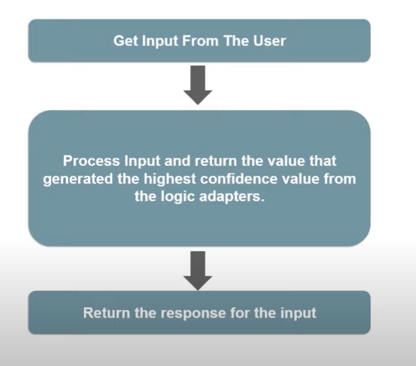
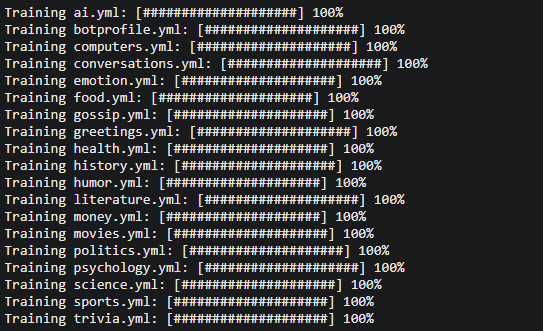

<html>
<h1>Python Chatbot</h1>

<h1>What is a Chatbot?</h1>
<h4>A chatbot is a computer program that's designed to simulate human conversation. Users communicate with these tools using a chat interface or via voice, just like they would converse with another person. Chatbots interpret the words given to them by a person and provide a pre-set answer.</h4>
<h4>Artificial intelligence, which brings into play machine learning and Natural language Processing (NLP) for building bot or chatbot, is specifically designed to unravel the smooth interaction between humans and computers.</h4>
<h1>How can Chatbots be useful?</h1>
<ul>
    <li><b>Increases operational efficiency.</b></li>
    <li><b>Automating customer request fulfillment.</b></li>
    <li><b>Handling basic queries, which in turn free employees to work for complex & higher value inquiries.</b></li>
    <li><b>Offers Multi-language support.</b></li>
    <li><b>Saves time & effort by automating customer support.</b></li>
    <li><b>Improves the response rate as well as customer engagement.</b></li>
    <li><b>Personalization of communication</b></li>
</ul>
<h1>Packages used:</h1>
<ul>
<li><h2>Chatterbot</h2></li>
    <b>ChatterBot is a Python library that makes it easy to generate automated responses to a user’s input. ChatterBot uses a selection of machine learning algorithms to produce different types of responses.</b>
<li><h2>Chatterbot Corpus</h2></li>
    <b>This is a corpus of dialog data that is included in the chatterbot module.</b>
</ul>
<h1>How does this chatbot work?</h1>

<ul>
<li><h4>After importing chatterbot and chatterbot corpus we create an instance of our chatbot class. We use logical adapters such as <code>chatterbot.logic.BestMatch</code> and <code>chatterbot.logic.TimeLogicAdapter</code>.</h4></li>
    <pre><code>bot = ChatBot(
        'Pranav',
        logic_adapters=[
            'chatterbot.logic.BestMatch',
            'chatterbot.logic.TimeLogicAdapter'],
    )</code></pre>
<li><h2>Logical Adapters</h2></li>
<h4>Logic adapters determine the logic for how ChatterBot selects a response to a given input statement. It is possible to enter any number of logic adapters for your bot to use. If multiple adapters are used, then the bot will return the response with the highest calculated confidence value. If multiple adapters return the same confidence, then the adapter that is entered into the list first will take priority.</h4>
<ul>
    <li><h3>chatterbot.logic.BestMatch</h3></li>
    <h4>The logic adapter returns a response based on known responses to the closest matches to the input statement.</h4>
    <li><h3>chatterbot.logic.BestMatch</h3></li>
    <h4>The TimeLogicAdapter identifies statements in which a question about the current time is asked. If a matching question is detected, then a response containing the current time is returned.</h4>
</ul>
<li><h2>Training our chatbot</h2></li>
<li><h4>ChatterBot includes tools that help simplify the process of training a chat bot instance. ChatterBot’s training process involves loading example dialog into the chat bot’s database. This either creates or builds upon the graph data structure that represents the sets of known statements and responses. When a chat bot trainer is provided with a data set, it creates the necessary entries in the chat bot’s knowledge graph so that the statement inputs and responses are correctly represented.</h4>
<pre><code>from chatterbot.trainers import ChatterBotCorpusTrainer</code></pre>
<h4>We can also train our chatterbot on a list using <code>chatterbot.trainers.ListTrainer</code></h4></li>
<li><h4>Making an instance of the ChatterbotCorpusTrainer</h4>
<pre><code>trainer.train('chatterbot.corpus.english')</code></pre></li>
<li><h4>Here I have trained the chatbot using the inbuilt data in the chatterbot corpus.</h4>
<pre><code>trainer.train('chatterbot.corpus.english')</code></pre>

<h4>For more info on the data, refer to the official repo of the <a href="https://github.com/gunthercox/chatterbot-corpus">ChatterbotCorpus</a> package.</h4></li>
<li><h4>This piece of code is pretty straight forward. It uses a while loop to get responses untill we get a 'Bye' from the user.</h4>
<pre><code>name=input("Enter Your Name: ")
print("Hi "+name+", how can I help you?")
while True:
    request=input(name+':')
    if request=='Bye' or request =='bye':
        print('Pranav: Bye')
        break
    else:
        response=bot.get_response(request)
        print('Pranav:',response)
</code></pre>
<h4>Here <code>get_response()</code> is a method of chatbot instance. It return the bot’s response based on the input.</h4></li>

<h1>Environment Setup and Local Installation:</h1>
<ol>
<li><b>Drop a &#9733; on the Github Repository. 
 

<li>Download Python IDE (recommended Anaconda IDE)
 
	<a href="https://docs.anaconda.com/anaconda/install/windows/">Install Anaconda for Windows</a> 
	<a href="https://docs.anaconda.com/anaconda/install/mac-os/">Install Anaconda for MacOS</a> 
	<a href="https://docs.anaconda.com/anaconda/install/linux/">Install Anaconda for Linux</a>
    </li>
 

<li>Clone the Repo by going to your local Git Client and pushing this command:
 
	<pre><code>git clone https://github.com/Pranav016/Python-Chatbot.git</code></pre>
</li> 

<li>Go to the AnacondaPrompt and use this command to install the packages. Open Jupyter Notebook to work-on/ use the chatbot:
<pre><code>
    pip install -r requirements.txt
</code></pre>
 
    or
 

Open the project in your Jupyter Notebook.
Run these commands in it.
<pre><code>
    !pip install chatterbot
    !pip install chatterbot_corpus
</code></pre>
</b></li></ol>
<h2>Licensed under <a href="LICENSE">MIT LICENSE</a></h2>
</html>