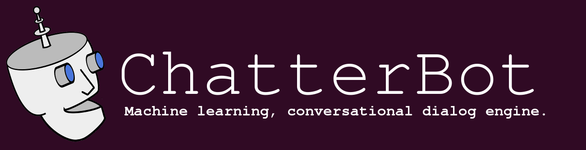

<html>
<h1>Python Chatbot</h1>

<h1>What is a Chatbot?</h1>
<h4>A chatbot is a computer program that's designed to simulate human conversation. Users communicate with these tools using a chat interface or via voice, just like they would converse with another person. Chatbots interpret the words given to them by a person and provide a pre-set answer.</h4>
<h4>Artificial intelligence, which brings into play machine learning and Natural language Processing (NLP) for building bot or chatbot, is specifically designed to unravel the smooth interaction between humans and computers.</h4>
<h1>How can Chatbots be useful?</h1>
<ul>
    <li><b>Increases operational efficiency.</b></li>
    <li><b>Automating customer request fulfillment.</b></li>
    <li><b>Handling basic queries, which in turn free employees to work for complex & higher value inquiries.</b></li>
    <li><b>Offers Multi-language support.</b></li>
    <li><b>Saves time & effort by automating customer support.</b></li>
    <li><b>Improves the response rate as well as customer engagement.</b></li>
    <li><b>Personalization of communication</b></li>
</ul>
<h1>Packages used:</h1>
<ul>
<li><h2>Chatterbot</h2></li>
    <b>ChatterBot is a Python library that makes it easy to generate automated responses to a user’s input. ChatterBot uses a selection of machine learning algorithms to produce different types of responses.</b>
<li><h2>Chatterbot Corpus</h2></li>
    <b>This is a corpus of dialog data that is included in the chatterbot module.</b>
</ul>
<h1>How does this chatterbot work?</h1>

<ul>
<li><h4>After importing chatterbot and chatterbot corpus we create an instance of our chatbot class. We use logical adapters such as <code>chatterbot.logic.BestMatch</code> and <code>chatterbot.logic.TimeLogicAdapter</code>.</h4></li>
    <code>bot = ChatBot( 
        'Pranav',   
        logic_adapters=[
            'chatterbot.logic.BestMatch', 
            'chatterbot.logic.TimeLogicAdapter'], 
    )</code>
<li><h2>Logical Adapters-</h2></li>
<h4>Logic adapters determine the logic for how ChatterBot selects a response to a given input statement. It is possible to enter any number of logic adapters for your bot to use. If multiple adapters are used, then the bot will return the response with the highest calculated confidence value. If multiple adapters return the same confidence, then the adapter that is entered into the list first will take priority.</h4>
<ul>
    <li><h3>chatterbot.logic.BestMatch</h3></li>
    <h4>The logic adapter returns a response based on known responses to the closest matches to the input statement.</h4>
    <li><h3>chatterbot.logic.BestMatch</h3></li>
    <h4>The TimeLogicAdapter identifies statements in which a question about the current time is asked. If a matching question is detected, then a response containing the current time is returned.</h4>
</ul>
<li><h4></h4></li>
<li><h4></h4></li>
<li><h4></h4></li>
<li><h4></h4></li>
</html>